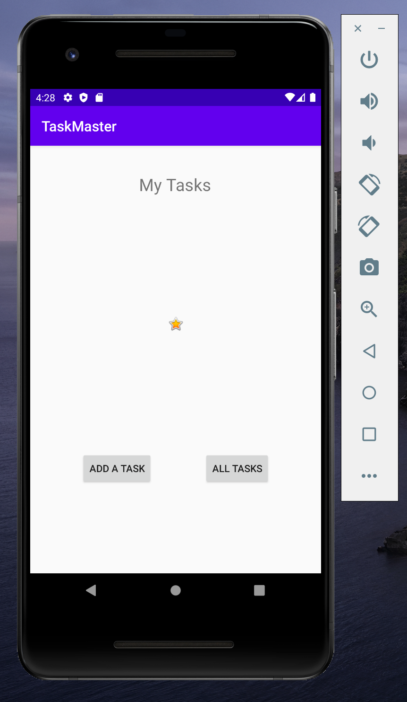
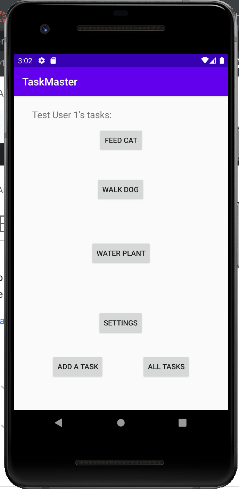
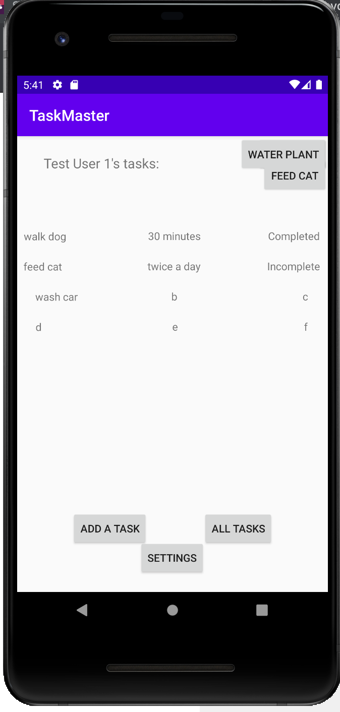

# taskmaster
## Overview
This app will provide a convenient system for users to add tasks, and keep track of their completion.

### Operation
1. Open in Android Studio
2. Build and run with green play button.
3. Run the app from a phone emulator (Pixel 2 was used for development)

### Lab 26 - Initial build 
- Main, add task, and all task activity pages built.
- Buttons from main function
- Used a toast notification to verify task add success.

### Lab 27 - Settings Page, Detail Page
- Created Detail page
- Created Settings page
- Added buttons to Home for three hard-coded tasks; those buttons correspond with title on Detail
- Username saves on Settings and displays on Main after a username has been entered

### Lab 28 - Recycler View
- Created TaskAdapter
- Created Fragment
- Recycler view tappable and implemented

### Screenshots
#### Lab26 Build

#### Lab27 Build

#### Lab28 Build

